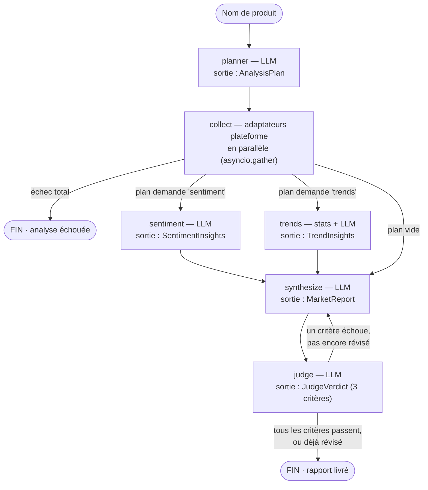

# Market Analysis Agent

> Agent d'analyse de marché e-commerce piloté par LLM et orchestré avec LangGraph — fonctionne de bout en bout **sans aucune clé API**, et change de fournisseur LLM en une seule variable d'environnement.


Le code couvre les étapes 1 à 3 de l'énoncé ; les étapes 4 à 7, théoriques, sont résumées plus bas et développées dans [docs/reponses-theoriques.md](docs/reponses-theoriques.md).

## Sommaire

1. [Présentation](#présentation)
2. [Architecture](#architecture)
3. [Démarrage rapide](#démarrage-rapide)
4. [Choix techniques et justifications](#choix-techniques-et-justifications)
5. [API](#api)
6. [Outils](#outils)
7. [Tests](#tests)
8. [Étape 4 — Architecture de données et stockage](#étape-4--architecture-de-données-et-stockage)
9. [Étape 5 — Monitoring et observabilité](#étape-5--monitoring-et-observabilité)
10. [Étape 6 — Scaling et optimisation](#étape-6--scaling-et-optimisation)
11. [Étape 7 — Amélioration continue et A/B testing](#étape-7--amélioration-continue-et-ab-testing)
12. [Limites connues et évolutions](#limites-connues-et-évolutions)

## Présentation

Étant donné un nom de produit (« iPhone 16 », « PS5 », « Dyson V15 »...), l'agent :

1. **planifie** l'analyse — complète par défaut, restreignable via le champ `analyses` de l'API ;
2. **collecte** les données multi-plateformes (Amazon, Best Buy, Walmart — adaptateurs mockés, données déterministes, prix en $ CAD) ;
3. **analyse en parallèle** le sentiment client (LLM) et les tendances de prix (statistiques pures + interprétation LLM) ;
4. **synthétise** un rapport métier structuré (résumé, analyse prix, recommandations priorisées, confiance) ;
5. **fait relire** le rapport par un LLM-as-judge, avec une boucle de révision bornée à une itération.

API REST JSON (soumission asynchrone + polling), conteneurisé, 66 tests 100 % hors-ligne. Fournisseur LLM **provider-agnostic** : `mock` par défaut (déterministe, zéro clé), ou Groq, DeepSeek, OpenRouter, OpenAI, Anthropic, Ollama, ainsi que tout endpoint compatible OpenAI — au choix d'une variable d'environnement.

Stack : Python 3.13 · LangGraph 1.2 · LangChain-core 1.4 · FastAPI · Pydantic v2 · `uv` · `ruff` · Docker.

## Architecture

### Le graphe



- **planner** *(LLM)* — produit un `AnalysisPlan` structuré `{analyses, platforms, rationale}` : analyse complète par défaut. Si la requête API impose `analyses` ou `platforms`, la contrainte est réappliquée en dur dans le code après l'appel — le plan ne dépend jamais de la bonne volonté du modèle.
- **collect** *(pas de LLM)* — interroge les adaptateurs en parallèle. Un échec total fait échouer l'analyse ; un échec partiel passe en mode dégradé.
- **sentiment** *(LLM)* — extraction structurée sur les avis : distribution, points forts/faibles, thèmes, citations.
- **trends** *(stats pures + LLM)* — régression, volatilité, écart concurrentiel calculés en Python pur ; le LLM n'écrit que l'interprétation. Aucune statistique ne peut être hallucinée.
- **synthesize** *(LLM)* — compile le `MarketReport` final, en intégrant erreurs de collecte et critique du juge en cas de révision.
- **judge** *(LLM)* — évalue **trois critères** : ancrage dans les données, complétude par rapport au plan, actionnabilité. Verdict pass/fail + commentaire par critère ; le rapport n'est accepté que si **tous** passent — conjonction appliquée en code, jamais déléguée au flag du modèle. Un échec déclenche au plus une révision (`MAX_SYNTHESIS_PASSES = 2` dans `graph.py`). Désactivable : `JUDGE_ENABLED=false`.

L'état circule dans un `TypedDict` unique (`agent/state.py`) ; les branches parallèles fusionnent sans conflit grâce aux reducers :

```python
class AnalysisState(TypedDict, total=False):
    sentiment: SentimentInsights | None      # écrite par un seul nœud
    trends: TrendInsights | None             # écrite par un seul nœud
    errors: Annotated[list[AnalysisError], operator.add]   # reducer : fan-in sans conflit
    usage: Annotated[list[LLMUsage], operator.add]
```

### Les couches

| Couche | Répertoire | Responsabilité |
|---|---|---|
| `api` | `src/market_agent/api/` | FastAPI : routes REST, schémas de requête/réponse, registre de jobs en mémoire |
| `agent` | `src/market_agent/agent/` | État du graphe (`AnalysisState`), implémentation des 6 nœuds, assemblage LangGraph (`StateGraph`) |
| `tools` | `src/market_agent/tools/` | Capacités pures et testables isolément : adaptateurs plateforme, sentiment, tendances, rendu du rapport |
| `llm` | `src/market_agent/llm/` | Factory provider-agnostic, seam `StructuredLLM`, implémentation LangChain, provider mock déterministe |
| `core` | `src/market_agent/core/` | Configuration (`pydantic-settings`), erreurs typées, logging JSON structuré |

Un processus par instance : chaque requête crée un `AnalysisState`, exécute le graphe en tâche de fond, et stocke le résultat dans un registre en mémoire — limite MVP assumée, détaillée à l'étape 4.

## Démarrage rapide

### Option A — Docker (recommandée, zéro clé)

```bash
docker compose up --build
```

Dans un autre terminal :

```bash
bash scripts/demo.sh                # "iPhone 16" par défaut
bash scripts/demo.sh "PS5"          # ou n'importe quel produit
```

`demo.sh` enchaîne health-check, soumission, polling, puis rapport Markdown et métadonnées. Chaque analyse terminée est **archivée** dans `runs/<horodatage>-<produit>-<id>/` (`analysis.json` + `report.md`) ; le volume Docker rend ces artefacts visibles sur l'hôte. Le provider par défaut est `mock` : aucun appel réseau, résultat reproductible pour n'importe quel produit.

### Option B — Local, sans Docker

```bash
uv sync                                                        # dépendances
uv run uvicorn market_agent.api.app:app --reload --port 8000   # serveur
bash scripts/demo.sh                                           # dans un autre terminal
```

### Passer à un vrai fournisseur LLM

```bash
cp .env.example .env
```

Décommenter le bloc du fournisseur voulu et renseigner `LLM_API_KEY`. Le serveur recharge `.env` au démarrage (`pydantic-settings`) ; Compose le charge nativement pour l'interpolation `${...}`.

### Configuration complète

Variables lues par `Settings` (`core/config.py`) depuis l'environnement ou `.env` :

| Variable | Défaut | Rôle |
|---|---|---|
| `LLM_PROVIDER` | `mock` | `mock` \| `groq` \| `deepseek` \| `openrouter` \| `openai` \| `anthropic` \| `ollama`, ou un nom libre + `LLM_BASE_URL` |
| `LLM_MODEL` | *(vide = défaut par fournisseur)* | voir `DEFAULT_MODELS` dans `llm/factory.py` |
| `LLM_API_KEY` | *(vide)* | requis sauf `mock`/`ollama` — vérifié au démarrage, échec immédiat sinon |
| `LLM_BASE_URL` | *(vide)* | force un endpoint OpenAI-compatible personnalisé |
| `LLM_TIMEOUT_S` | `60` | timeout par appel LLM |
| `JUDGE_ENABLED` | `true` | `false` pour sauter le juge et sa boucle de révision |
| `ANALYSIS_TIMEOUT_S` | `300` | timeout global par analyse |
| `RUNS_DIR` | `runs` | dossier d'archivage des analyses ; vide pour désactiver |
| `LOG_LEVEL` | `INFO` | niveau du logger racine (JSON structuré) |

## Choix techniques et justifications

> *« La qualité de la réflexion et la clarté de vos justifications sont plus importantes que la quantité de fonctionnalités. »* — la grille de lecture de chaque arbitrage ci-dessous.

### LangGraph, plutôt qu'une boucle native ou le Claude Agent SDK

**Orchestration native** (boucle `asyncio` sans framework) : écartée. Ré-implémenter fan-out parallèle, suivi d'état, boucle bornée et reprise sur erreur n'apporte aucune valeur différenciante ici, avec un vrai risque de bugs de plomberie. LangGraph fournit ces briques nativement.

**Claude Agent SDK** : écarté après vérification concrète, pas par principe. L'empaquetage Docker n'était pas un obstacle (le package pip embarque le binaire) ; le point bloquant est qu'en mode headless, le SDK impose une `ANTHROPIC_API_KEY` — incompatible avec l'exigence provider-agnostic : l'évaluateur doit pouvoir lancer l'agent avec la clé qu'il a, ou aucune.

**LangGraph** retenu : contrôle explicite du graphe (fan-out, boucle bornée par construction) sans réécrire un runtime, et une abstraction de modèle (`langchain-core`) qui ne verrouille aucun fournisseur.

### Le pattern hybride : « le LLM décide, le graphe garantit »

Aucune règle métier codée en dur : le nœud `planner` (LLM, sortie structurée) décide *quoi* faire. Le graphe garantit *comment* : routage conditionnel (`route_after_collect`), fan-out réellement parallèle entre `sentiment` et `trends`, fan-in sans conflit par reducers, et boucle de révision strictement bornée (`route_after_judge` — jamais de boucle infinie, même si le juge reste insatisfait). Résultat : un agent piloté par LLM qui reste prévisible, testable et borné.

### Un seul seam pour tous les appels LLM : `StructuredLLM`

Chaque appel LLM — planner, sentiment, trends, synthesize, judge — passe par `StructuredLLM.generate(schema, system, user, context, purpose)` (`llm/base.py`) : schéma Pydantic en entrée, objet validé + usage en sortie. Deux implémentations :

- `LangChainStructuredLLM` — `with_structured_output(include_raw=True)`, avec une reprise correctrice si le premier parsing échoue (fiabilise les petits modèles) ;
- `MockStructuredLLM` — simulateur déterministe qui construit une instance valide du schéma depuis le `context`, seedé par le produit.

Ce seam rend possibles à la fois la démo zéro-clé et les 66 tests hors-ligne. Côté fournisseurs réels : `ChatAnthropic` natif pour Anthropic, un unique `ChatOpenAI` + `base_url` pour tout le reste — un seul client à maintenir pour six fournisseurs.

### Dégradation gracieuse plutôt qu'échec binaire

Chaque nœud à risque capture ses exceptions et les convertit en `AnalysisError` typé (`code`, `source`, `message`, `recoverable`), accumulé dans l'état via reducer. Seul un échec total de collecte arrête l'analyse ; tout le reste continue en mode dégradé, et `synthesize` traduit les manques en `caveats` explicites avec confiance réduite. Même principe pour le juge : s'il est indisponible, un verdict de secours (`passed=True`) est renvoyé plutôt que de perdre un rapport terminé.

## API

| Méthode & route | Description |
|---|---|
| `POST /api/v1/analyses` | Soumet une analyse. Corps : `{product, platforms?, analyses?, language?}`. Réponse `202 {id, status}` ; avec `?wait=true`, bloque et renvoie la ressource complète (`200`). |
| `GET /api/v1/analyses` | Historique (plus récentes en premier). |
| `GET /api/v1/analyses/{id}` | Statut + résultat : rapport, plan, verdict du juge, erreurs, métadonnées (`provider`, `model`, `duration_ms`, `llm_calls`, tokens, `judge_passed`, `judge_criteria`, `revised`, `degraded`). |
| `GET /api/v1/analyses/{id}/report.md` | Le rapport rendu en Markdown (`text/markdown`). |
| `GET /health` | Liveness + fournisseur/modèle actif (aucun secret exposé). |

`analyses: "auto"` (défaut) déclenche l'analyse complète ; une liste explicite (ex. `["trends"]`) restreint le périmètre — contrainte garantie, appliquée côté code.

### Exemples

**1. Synchrone — une requête, une réponse**

```bash
curl -s -X POST "http://localhost:8000/api/v1/analyses?wait=true" \
  -H 'Content-Type: application/json' \
  -d '{"product": "iPhone 16"}' | python3 -m json.tool
```

**2. Asynchrone + polling**

```bash
ID=$(curl -s -X POST "http://localhost:8000/api/v1/analyses" \
  -H 'Content-Type: application/json' \
  -d '{"product": "PS5"}' | python3 -c 'import json,sys; print(json.load(sys.stdin)["id"])')

# à répéter jusqu'à status == "done" (ou "failed")
curl -s "http://localhost:8000/api/v1/analyses/$ID" | python3 -m json.tool
```

Swagger UI sur `http://localhost:8000/docs` ; schéma OpenAPI sur `/openapi.json`.

Un exemple complet est committé (`examples/request.json`, `examples/report-nintendo-switch-2.md`, `examples/response-nintendo-switch-2.json`) — généré par une exécution réelle avec un vrai fournisseur (`gpt-5.6-luna` ; les trois critères du juge au vert, confiance 0,88), pas rédigé à la main. Le mode `mock` zéro-clé produit la même structure, en plus simple. Extrait :

```markdown
# Rapport d'analyse de marché — Nintendo Switch 2

## Synthèse
Le marché canadien de la Nintendo Switch 2 présente une demande contrastée selon les
enseignes : Amazon affiche la popularité la plus élevée avec 74,8/100, devant Walmart à
63,7/100 [...] Walmart propose les prix les plus bas dans les données collectées, avec
des offres de 189,04 à 224,69 CAD [...] Le sentiment client est globalement favorable :
78,1 % des 32 avis analysés sont positifs ou très positifs.

[... analyse des prix, sentiment client, tendances, recommandations : fichier complet]
```

## Outils

Les outils (`tools/`) sont des fonctions/classes Python typées, sans dépendance à LangGraph ; les nœuds du graphe sont de fins wrappers. Cette séparation capacité/orchestration permet de tester chaque outil isolément.

**1. Scraper — `tools/scraper/`.** `PlatformAdapter` : une méthode, `fetch(query) -> PlatformData` (offres, avis, historique de prix, popularité). Trois mocks enregistrés dans `KNOWN_PLATFORMS` : Amazon, Best Buy, Walmart ($ CAD). Données générées déterministiquement, seedées par `(produit, plateforme)` : n'importe quel produit fonctionne, même entrée, mêmes données. **Extension réelle** : implémenter `fetch()` sur une vraie source et l'enregistrer — aucune autre modification, ni dans le graphe, ni dans l'API.

**2. Analyseur de sentiment — `tools/sentiment.py`.** Un prompt ciblé qui interdit d'inventer un point non ancré dans les avis fournis. Sortie structurée `SentimentInsights` : distribution, points forts/faibles, thèmes, citations, résumé. Une liste d'avis vide lève une erreur explicite, remontée comme dégradation.

**3. Analyseur de tendances — `tools/trends.py`.** `compute_trend_stats` est du Python pur : régression (moindres carrés) sur la moyenne journalière, volatilité, min/max/moyenne, plateformes la moins/la plus chère et écart en %. Le LLM n'écrit que l'interprétation — l'arithmétique ne transite jamais par le modèle.

**4. Générateur de rapport — `tools/report.py`.** `MarketReport` (Pydantic) est le contrat renvoyé en JSON ; `render_markdown()` projette le même modèle en Markdown français. Une seule source de vérité : les deux représentations restent synchronisées par construction.

## Tests

```bash
uv run pytest -q
```

66 tests, tous hors-ligne et déterministes (~2 s). Le provider `mock` alimente tous les appels LLM ; les adaptateurs mockés font de même côté données. `pytest-asyncio` en mode `auto`.

| Fichier | Tests | Couvre |
|---|---|---|
| `test_nodes.py` | 13 | Chaque nœud à l'unité — contraintes du planner, résilience de `collect`, dégradation `sentiment`/`trends`/`judge`, conjonction des critères appliquée en code |
| `test_llm.py` | 10 | Factory par fournisseur, sémantique du mock, retry correctif LangChain |
| `test_registry.py` | 9 | Cycle de vie d'un job, timeout / crash / échec de finalisation, archivage `runs/` |
| `test_api.py` | 8 | `?wait=true`, async + poll, 422/404, run dégradé, `report.md`, fail-fast si clé manquante |
| `test_graph.py` | 6 | Bout en bout : routage conditionnel, fan-out/fan-in, révision exécutée exactement une fois, échec total, juge désactivable |
| `test_config.py` | 5 | Lecture des variables d'environnement (`Settings`) |
| `test_scraper.py` | 5 | Déterminisme des adaptateurs, validité des schémas générés |
| `test_report.py` | 3 | Rendu Markdown |
| `test_trends.py` | 3 | Statistiques sur des séries connues |
| `test_models.py` | 2 | Bornes de validation des modèles |
| `test_sentiment.py` | 2 | Extraction sur avis scriptés, garde sur liste vide |

`uv run ruff check` et `uv run ruff format --check` sont propres sur `src` et `tests`.

## Étape 4 — Architecture de données et stockage

**En résumé :** PostgreSQL comme source de vérité (`JSONB`, quatre tables : `analyses`, `analysis_events`, `collected_data_cache`, `agent_configs`), Redis cantonné à la file de jobs et au cache chaud, stockage objet pour les rapports rendus — dont `runs/` est l'embryon local livré. Le registre en mémoire est le choix MVP assumé que cette architecture remplace.

**Réponse complète : [docs/reponses-theoriques.md](docs/reponses-theoriques.md#étape-4--architecture-de-données-et-stockage)**

## Étape 5 — Monitoring et observabilité

**En résumé :** le logging JSON structuré est déjà en place (`core/logging.py`) et s'expédie tel quel vers Loki/Datadog/ELK ; au-dessus, spans OpenTelemetry par nœud et LangSmith en complément LLM. Métriques clés : latence, échecs par outil (`AnalysisError.source`), tokens par analyse (`LLMUsage`), verdicts du juge par critère, taux de révision — avec alerting sur les dérives.

**Réponse complète : [docs/reponses-theoriques.md](docs/reponses-theoriques.md#étape-5--monitoring-et-observabilité)**

## Étape 6 — Scaling et optimisation

**En résumé :** API stateless répliquée + file Redis/RabbitMQ + pool de workers (l'état sort du processus, voir étape 4) ; backpressure et quotas pour 100+ analyses simultanées ; coûts LLM par routage de modèle selon la tâche (le champ `purpose` existe déjà), prompt caching, batch ; cache à trois niveaux ; parallélisation déjà démontrée dans le graphe livré.

**Réponse complète : [docs/reponses-theoriques.md](docs/reponses-theoriques.md#étape-6--scaling-et-optimisation)** (avec le schéma de déploiement)

## Étape 7 — Amélioration continue et A/B testing

**En résumé :** le LLM-as-judge est déjà implémenté (verdicts par critère + boucle bornée) — l'étendre en évaluation offline sur un golden set est direct ; prompts versionnés dans `agent_configs` avec A/B par assignation déterministe ; un endpoint de feedback utilisateur (à ajouter) alimente le jeu labellisé ; un nouveau type d'analyse s'ajoute comme une branche du graphe, avec déploiement canary.

**Réponse complète : [docs/reponses-theoriques.md](docs/reponses-theoriques.md#étape-7--amélioration-continue-et-ab-testing)**

## Limites connues et évolutions

- **Données mockées** — pas de scraping réel (fragilité, CGU des marketplaces). La seam `PlatformAdapter` est prête pour un vrai adaptateur ; aucun n'est branché.
- **Registre de jobs en mémoire** — mono-processus ; le statut API repart de zéro au redémarrage (les artefacts survivent dans `runs/`). Upgrade Postgres/Redis argumentée à l'étape 4.
- **Pas d'authentification** — à ajouter avant tout déploiement non local (clé API, quotas par client — voir étape 6).
- **Progression par polling** — pas de streaming ; un flux SSE nœud par nœud a existé puis a été retiré pour garder le périmètre simple (rejeu durable via `analysis_events`, étape 4).
- **Pas de cache** — chaque requête rejoue tout le graphe (voir étape 6).
- **Coût non chiffré** — tokens mesurés par analyse (`LLMUsage`), conversion en coût non implémentée (étape 5).
- **Un seul juge, une seule grille** — pas de vote multi-modèle, pas encore de golden set (étape 7).

---

Vérifié le 20 juillet 2026 : `uv run pytest -q` (66 tests), `ruff check` + `ruff format --check`, `docker compose up --build` et `bash scripts/demo.sh` exécutés avec succès avant commit.
