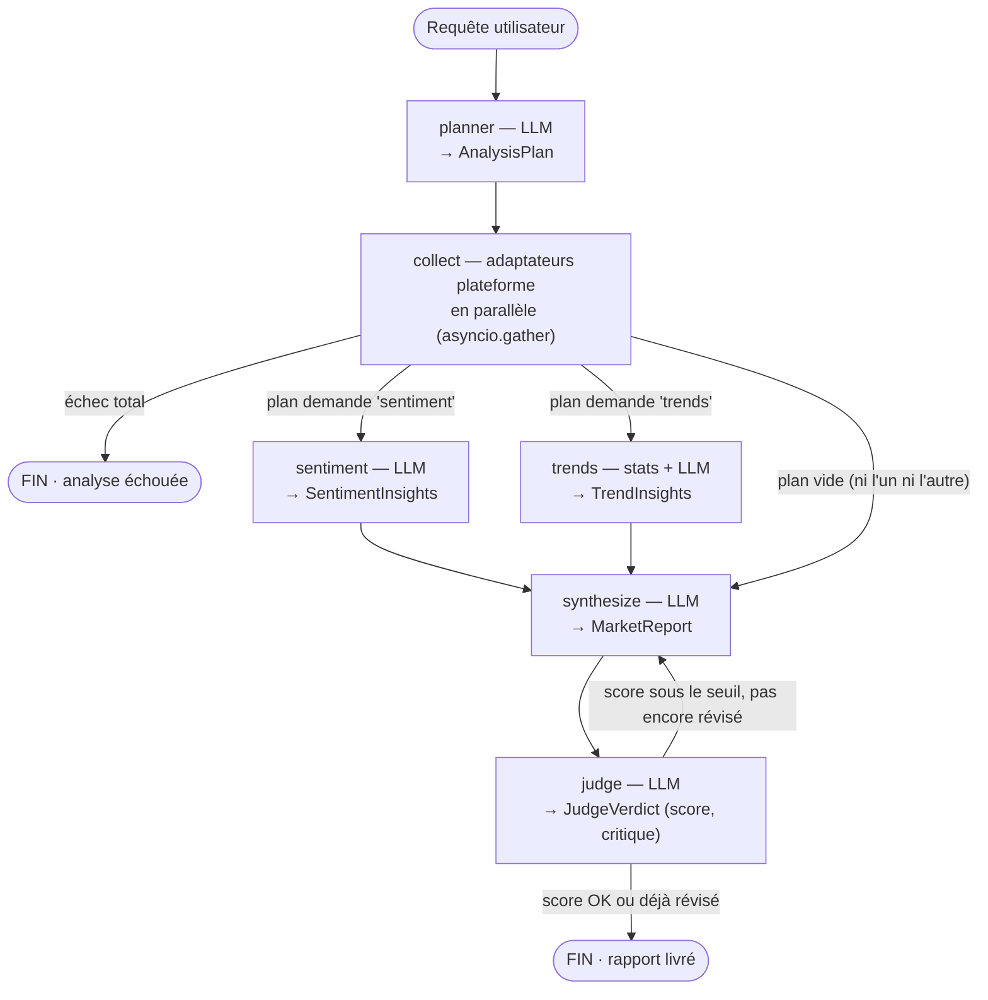
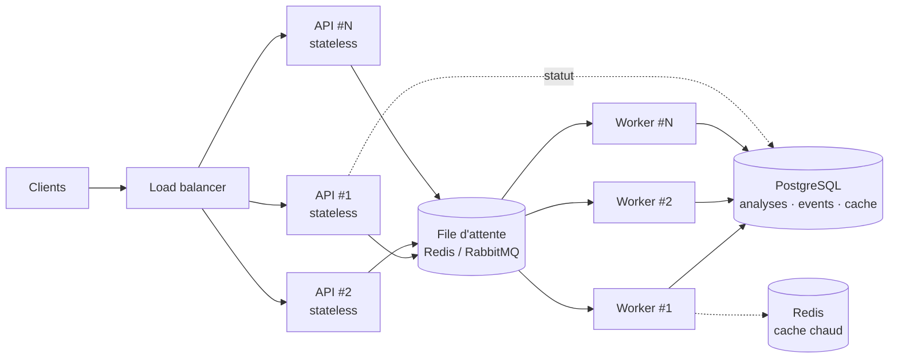

# Market Analysis Agent

> Agent d'analyse de marché e-commerce piloté par LLM et orchestré avec LangGraph — fonctionne de bout en bout **sans aucune clé API**, et change de fournisseur LLM en une seule variable d'environnement.

*(Code, identifiants et commentaires en anglais ; ce README et les rapports générés sont en français.)*

Test technique « Développeur IA — Agent d'analyse de marché e-commerce ». Ce dépôt couvre l'intégralité du périmètre code (étapes 1 à 3 de l'énoncé : architecture, outils, tests) ; les étapes 4 à 7, théoriques, sont traitées plus bas dans ce même README, avec des réponses ancrées dans le code réellement livré plutôt que dans l'abstrait.

## Sommaire

1. [Présentation](#présentation)
2. [Architecture](#architecture)
3. [Démarrage rapide](#démarrage-rapide)
4. [Choix techniques et justifications](#choix-techniques-et-justifications)
5. [API](#api)
6. [Outils](#outils)
7. [Tests](#tests)
8. [Étape 4 — Architecture de données et stockage](#étape-4--architecture-de-données-et-stockage)
9. [Étape 5 — Monitoring et observabilité](#étape-5--monitoring-et-observabilité)
10. [Étape 6 — Scaling et optimisation](#étape-6--scaling-et-optimisation)
11. [Étape 7 — Amélioration continue et A/B testing](#étape-7--amélioration-continue-et-ab-testing)
12. [Limites connues et évolutions](#limites-connues-et-évolutions)

## Présentation

Étant donné un nom de produit (« iPhone 16 », « PS5 », « Dyson V15 »...), l'agent :

1. **planifie** l'analyse — complète par défaut (toutes les analyses, toutes les plateformes), restreignable via le champ `analyses` de l'API ;
2. **collecte** des données multi-plateformes (Amazon, Best Buy, Walmart — trois adaptateurs mockés, données déterministes et réalistes, prix en $ CAD) ;
3. **analyse en parallèle** le sentiment client (LLM) et les tendances de prix (statistiques pures + interprétation LLM) ;
4. **synthétise** un rapport métier structuré (résumé, analyse prix, recommandations priorisées, niveau de confiance) ;
5. **fait relire** ce rapport par un second LLM jouant le rôle de contrôle qualité, avec une boucle de révision bornée à une seule itération.

Le tout est exposé par une API REST JSON (soumission asynchrone + polling du statut), conteneurisé, et couvert par 64 tests unitaires/intégration, 100 % hors-ligne. Le fournisseur LLM est **provider-agnostic** : `mock` (simulateur déterministe, zéro clé, zéro coût — le mode par défaut) ou, au choix d'une seule variable d'environnement, Groq, DeepSeek, OpenRouter, OpenAI, Anthropic ou Ollama en local, ainsi que tout endpoint compatible OpenAI.

Stack : Python 3.13 · LangGraph 1.2 · LangChain-core 1.4 · FastAPI · Pydantic v2 · `uv` · `ruff` · Docker.

## Architecture

### Le graphe



- **planner** *(LLM)* — reçoit le nom du produit et produit un `AnalysisPlan` structuré `{analyses, platforms, rationale}`. Par défaut : l'analyse **complète** (sentiment + tendances, toutes plateformes). Le champ `analyses` de la requête API restreint le périmètre de façon garantie — la contrainte est réappliquée en dur dans le code après l'appel LLM, le plan ne dépend jamais de la bonne volonté du modèle. Si la requête HTTP impose déjà les analyses ou les plateformes, le planner les traite comme une contrainte dure et ne planifie que le reste.
- **collect** *(pas de LLM)* — interroge les adaptateurs plateforme en parallèle (`asyncio.gather` + `asyncio.to_thread`). Un échec total (aucune plateforme ne répond) arrête l'analyse ; un échec partiel dégrade mais continue.
- **sentiment** *(LLM)* — extraction structurée sur les avis collectés : distribution positif/neutre/négatif, points forts/faibles récurrents, thèmes, citations représentatives.
- **trends** *(statistiques pures + LLM)* — régression sur l'historique de prix (pente, volatilité, écart concurrentiel, popularité) calculée en Python pur, puis une interprétation courte générée par LLM. Le calcul ne passe jamais par le modèle : aucune statistique ne peut être hallucinée.
- **synthesize** *(LLM)* — compile le `MarketReport` final à partir de tout ce qui précède, en tenant compte des éventuelles erreurs de collecte et de la critique du juge en cas de révision.
- **judge** *(LLM)* — note le rapport sur une grille {ancrage dans les données, complétude par rapport au plan, actionnabilité}, et déclenche au plus **une** révision si le score est sous le seuil (`JUDGE_THRESHOLD`, 0.7 par défaut — voir `MAX_SYNTHESIS_PASSES = 2` dans `graph.py`, qui borne la boucle par construction). Désactivable via `JUDGE_ENABLED=false`.

L'état circule dans un `TypedDict` unique (`agent/state.py`) ; les clés remplies par les branches parallèles utilisent des reducers pour un fan-in sans conflit :

```python
class AnalysisState(TypedDict, total=False):
    sentiment: SentimentInsights | None      # écrite par un seul nœud
    trends: TrendInsights | None             # écrite par un seul nœud
    errors: Annotated[list[AnalysisError], operator.add]   # reducer : fan-in sans conflit
    usage: Annotated[list[LLMUsage], operator.add]
```

### Les couches

| Couche | Répertoire | Responsabilité |
|---|---|---|
| `api` | `src/market_agent/api/` | FastAPI : routes REST, schémas de requête/réponse, registre de jobs en mémoire |
| `agent` | `src/market_agent/agent/` | État du graphe (`AnalysisState`), implémentation des 6 nœuds, assemblage LangGraph (`StateGraph`) |
| `tools` | `src/market_agent/tools/` | Capacités pures et testables isolément : adaptateurs plateforme, sentiment, tendances, rendu du rapport |
| `llm` | `src/market_agent/llm/` | Factory provider-agnostic, seam `StructuredLLM`, implémentation LangChain, provider mock déterministe |
| `core` | `src/market_agent/core/` | Configuration (`pydantic-settings`), erreurs typées, logging JSON structuré |

Un processus unique par instance : chaque requête HTTP crée un `AnalysisState`, exécute le graphe compilé de façon asynchrone (tâche de fond, statut interrogeable), et stocke le résultat dans un registre en mémoire — limite assumée du MVP, détaillée à l'étape 4.

## Démarrage rapide

### Option A — Docker (recommandée, zéro clé)

```bash
docker compose up --build
```

Dans un autre terminal :

```bash
bash scripts/demo.sh                # utilise "iPhone 16" par défaut
bash scripts/demo.sh "PS5"          # ou n'importe quelle requête
```

`demo.sh` enchaîne un health-check, soumet une analyse, interroge le statut jusqu'à complétion, puis imprime le rapport Markdown et les métadonnées (tokens, score du juge). Chaque analyse terminée est aussi **archivée localement** dans `runs/<horodatage>-<produit>-<id>/` (`analysis.json` + `report.md`) — avec Docker, le volume monté rend ces artefacts visibles sur la machine hôte. Le fournisseur par défaut (`LLM_PROVIDER=mock`, voir `docker-compose.yml`) est un simulateur déterministe : aucune clé API, aucun appel réseau sortant, résultat reproductible pour n'importe quelle requête.

### Option B — Local, sans Docker

```bash
uv sync                                                        # dépendances
uv run uvicorn market_agent.api.app:app --reload --port 8000   # serveur
bash scripts/demo.sh                                           # dans un autre terminal
```

### Passer à un vrai fournisseur LLM

```bash
cp .env.example .env
```

Décommenter le bloc du fournisseur voulu (Groq, DeepSeek, OpenRouter, OpenAI, Anthropic, Ollama en local, ou tout endpoint OpenAI-compatible via `LLM_BASE_URL`) et renseigner `LLM_API_KEY`. Le serveur recharge `.env` automatiquement au démarrage (`pydantic-settings`) ; avec Docker, exportez les mêmes variables avant `docker compose up`, ou déposez-les dans `.env` — Compose le charge nativement pour l'interpolation `${...}` du `docker-compose.yml`.

### Configuration complète

Toutes les variables sont lues par `Settings` (`core/config.py`, `pydantic-settings`) depuis l'environnement ou `.env` :

| Variable | Défaut | Rôle |
|---|---|---|
| `LLM_PROVIDER` | `mock` | `mock` \| `groq` \| `deepseek` \| `openrouter` \| `openai` \| `anthropic` \| `ollama`, ou un nom libre accompagné de `LLM_BASE_URL` |
| `LLM_MODEL` | *(vide → défaut par fournisseur)* | voir `DEFAULT_MODELS` dans `llm/factory.py` |
| `LLM_API_KEY` | *(vide)* | requis pour tout fournisseur sauf `mock`/`ollama` — vérifié au démarrage, échec immédiat sinon (`validate_llm_settings`) |
| `LLM_BASE_URL` | *(vide)* | force un endpoint OpenAI-compatible personnalisé |
| `LLM_TIMEOUT_S` | `60` | timeout par appel LLM |
| `JUDGE_ENABLED` | `true` | passe à `false` pour sauter le nœud `judge` et sa boucle de révision |
| `JUDGE_THRESHOLD` | `0.7` | score minimal pour qu'un rapport soit accepté sans révision |
| `ANALYSIS_TIMEOUT_S` | `300` | timeout global par analyse (couvre tout le graphe) |
| `RUNS_DIR` | `runs` | dossier d'archivage local des analyses terminées (`analysis.json` + `report.md`) ; vide pour désactiver |
| `LOG_LEVEL` | `INFO` | niveau du logger racine (JSON structuré, voir étape 5) |

## Choix techniques et justifications

> *« La qualité de la réflexion et la clarté de vos justifications sont plus importantes que la quantité de fonctionnalités. »* — c'est la grille de lecture qui a guidé chaque arbitrage ci-dessous.

### LangGraph, plutôt qu'une boucle native ou le Claude Agent SDK

Trois options ont été sérieusement comparées avant d'écrire la première ligne de `agent/graph.py`.

**Une orchestration native** (boucle `asyncio` + appels LLM directs, sans framework) aurait été la démonstration la plus « from scratch » de maîtrise des fondamentaux. Mais son coût réel — ré-implémenter proprement le fan-out parallèle, le suivi d'état entre nœuds, une boucle de révision bornée, la reprise sur erreur — n'apporte aucune valeur différenciante pour ce test : ce n'est pas là-dessus que se juge la qualité de la réflexion, et le risque de bugs de plomberie (état partagé, races) est réel. LangGraph fournit ces briques nativement (`StateGraph`, edges conditionnels pouvant retourner plusieurs branches à la fois, merge d'état par reducers) et laisse le budget disponible pour ce qui compte réellement : la conception du graphe et sa justification écrite.

**Le Claude Agent SDK** a été écarté après vérification concrète, pas par principe. Le package pip embarque déjà le binaire CLI nécessaire — l'empaquetage Docker n'aurait donc pas été un obstacle. Le point réellement bloquant est ailleurs : en mode headless (sans session interactive), le SDK impose une `ANTHROPIC_API_KEY` ; il n'existe pas de chemin headless multi-fournisseur. Cela entre frontalement en conflit avec l'exigence provider-agnostic du test — un évaluateur sans clé Anthropic, ou préférant Groq/DeepSeek/Ollama, doit pouvoir lancer l'agent tel quel.

**LangGraph** a donc été retenu : contrôle explicite du graphe (fan-out parallèle, boucle de révision bornée par construction) sans réécrire un runtime d'orchestration, et une abstraction de modèle (via `langchain-core`) qui ne verrouille aucun fournisseur.

### Le pattern hybride : « le LLM décide, le graphe garantit »

Le graphe ne code aucune règle métier du type « si la requête contient tel mot, fais telle analyse ». C'est le nœud `planner` — un appel LLM à sortie structurée (`AnalysisPlan`) — qui décide *quoi* faire. Le graphe, lui, garantit *comment* ce plan s'exécute : routage conditionnel vers les branches demandées (`route_after_collect`), fan-out parallèle réel entre `sentiment` et `trends` (deux nœuds indépendants activés simultanément, pas une boucle séquentielle), fan-in sans conflit grâce aux reducers de `AnalysisState`, et boucle de révision strictement bornée (`route_after_judge` ne renvoie vers `synthesize` que si `revision_count < MAX_SYNTHESIS_PASSES`, donc au plus une révision, jamais de boucle infinie même si le juge reste insatisfait).

Cette séparation — le LLM au point de décision, le graphe pour l'ingénierie autour — permet au système de rester prévisible (testable, borné, observable) tout en gardant la flexibilité d'un agent réellement piloté par LLM plutôt qu'un pipeline figé.

### Un seul seam pour tous les appels LLM : `StructuredLLM`

Chaque appel LLM du système — planner, sentiment, trends, synthesize, judge — passe par un unique point d'entrée : le protocole `StructuredLLM.generate(schema, system, user, context, purpose)` (`llm/base.py`), qui prend un schéma Pydantic et renvoie un objet validé plus l'usage (tokens). Deux implémentations :

- `LangChainStructuredLLM` (`llm/langchain_impl.py`) — s'appuie sur `with_structured_output(schema, include_raw=True)` de LangChain, avec une reprise correctrice unique si le premier parsing échoue (utile avec des modèles moins fiables sur la sortie structurée) ;
- `MockStructuredLLM` (`llm/mock.py`) — un simulateur déterministe qui construit une instance valide du schéma demandé à partir du `context` fourni, sans parser de texte libre, seedé par la requête pour rester reproductible.

Cette seam rend possible à la fois la démo zéro-clé (le provider mock alimente tout le pipeline) **et** les 64 tests unitaires (aucun test n'effectue d'appel réseau — voir la section Tests). Côté fournisseurs réels, la factory (`llm/factory.py`) branche `ChatAnthropic` nativement pour Anthropic, et un unique `ChatOpenAI` + `base_url` pour tout le reste (Groq, DeepSeek, OpenRouter, Ollama, ou un endpoint compatible arbitraire) — un seul client à maintenir pour six fournisseurs.

### Dégradation gracieuse plutôt qu'échec binaire

Une erreur sur une plateforme, une analyse de sentiment qui échoue, ou même un juge indisponible ne font pas planter l'analyse : `AnalysisError` (`core/errors.py`) est un modèle typé (`code`, `source`, `message`, `recoverable`) accumulé dans `state["errors"]` via un reducer, et chaque nœud à risque (`sentiment`, `trends`, `judge`) attrape ses propres exceptions pour les convertir en `AnalysisError` plutôt que de laisser planter le graphe. Seul un échec total de la collecte (aucune plateforme n'a répondu) arrête l'analyse avant la synthèse — un échec partiel continue en mode dégradé. Le nœud `synthesize` traduit ces erreurs et les analyses manquantes en `caveats` explicites dans le rapport final, avec une confiance réduite. Le juge suit le même principe : s'il échoue lui-même, l'analyse n'est pas invalidée pour autant — un verdict de secours (`passed=True`) est renvoyé plutôt que de perdre un rapport par ailleurs terminé.

## API

| Méthode & route | Description |
|---|---|
| `POST /api/v1/analyses` | Soumet une analyse. Corps : `{product, platforms?, analyses?, language?}` (voir `AnalyzeRequest`) — `product` est le nom du produit à analyser. Réponse `202 {id, status}`. Avec `?wait=true`, bloque jusqu'à la fin et renvoie directement la ressource complète (`200`). |
| `GET /api/v1/analyses` | Historique des analyses (registre en mémoire, plus récentes en premier). |
| `GET /api/v1/analyses/{id}` | Statut + résultat complet : rapport, plan, verdict du juge, erreurs, métadonnées (`provider`, `model`, `duration_ms`, `llm_calls`, tokens, `judge_score`, `revised`, `degraded`). |
| `GET /api/v1/analyses/{id}/report.md` | Le rapport rendu en Markdown brut (`text/markdown`). |
| `GET /health` | Liveness + fournisseur/modèle actif en place (aucun secret exposé). |

`analyses: "auto"` (valeur par défaut) déclenche l'analyse complète ; fournir une liste explicite (`["trends"]` par exemple) restreint l'analyse à ce périmètre — contrainte garantie, appliquée en dur côté code.

### Exemples

**1. Synchrone — une requête, une réponse**

```bash
curl -s -X POST "http://localhost:8000/api/v1/analyses?wait=true" \
  -H 'Content-Type: application/json' \
  -d '{"product": "iPhone 16"}' | python3 -m json.tool
```

**2. Asynchrone + polling**

```bash
ID=$(curl -s -X POST "http://localhost:8000/api/v1/analyses" \
  -H 'Content-Type: application/json' \
  -d '{"product": "PS5"}' | python3 -c 'import json,sys; print(json.load(sys.stdin)["id"])')

# à répéter jusqu'à status == "done" (ou "failed")
curl -s "http://localhost:8000/api/v1/analyses/$ID" | python3 -m json.tool
```

Documentation interactive complète (Swagger UI, générée automatiquement par FastAPI à partir des schémas Pydantic) sur `http://localhost:8000/docs` ; schéma OpenAPI brut sur `/openapi.json`.

Un exemple de requête (`examples/request.json`), le rapport Markdown correspondant (`examples/report-iphone-16.md`) et la ressource JSON complète qu'il produit (`examples/response-iphone-16.json`) sont committés dans le dépôt — générés par une exécution réelle du système, pas rédigés à la main :

```markdown
# Rapport d'analyse de marché — iPhone 16

## Synthèse
Analyse de marché pour iPhone 16. Prix moyen constaté : 786.46 $ CAD. Position concurrentielle favorable.

## Sentiment client
Sentiment majoritairement positif (50% positif, 40% négatif) pour iPhone 16.

## Tendances
Les prix sont en hausse sur la période, avec un écart de 17.3% entre la plateforme la moins
chère (walmart) et la plus chère (bestbuy).
```

## Outils

Les outils (`tools/`) sont de simples fonctions/classes Python typées, sans dépendance à LangGraph — les nœuds du graphe (`agent/nodes.py`) sont de fins wrappers qui les appellent. Cette séparation outil (capacité) / nœud (orchestration) permet de tester chaque outil isolément et de le réutiliser hors du graphe si besoin.

**1. Scraper — `tools/scraper/`.** `PlatformAdapter` est une classe abstraite avec une seule méthode : `fetch(query) -> PlatformData` (offres, avis, historique de prix, score de popularité). Trois implémentations mockées sont enregistrées dans `KNOWN_PLATFORMS` : Amazon, Best Buy, Walmart — les grandes plateformes du marché nord-américain, prix en $ CAD. Les données sont générées de façon déterministe, seedées par `(requête, plateforme)` (`tools/scraper/mock_data.py`) : n'importe quelle requête fonctionne (pas de catalogue codé en dur) et la même requête renvoie toujours les mêmes données, ce qui rend démos et tests reproductibles. **Extension vers des données réelles** (seam documentée, non implémentée) : écrire un nouvel adaptateur qui implémente `fetch()` en interrogeant une vraie source, et l'enregistrer dans `KNOWN_PLATFORMS` — aucune autre modification n'est nécessaire, ni dans `collect`, ni dans le graphe, ni dans l'API.

**2. Analyseur de sentiment — `tools/sentiment.py`.** Un prompt unique et ciblé (`analyze_sentiment`) qui instruit le LLM de ne jamais inventer un point positif ou négatif non ancré dans les avis fournis, et de répondre dans la langue demandée. Sortie structurée (`SentimentInsights`) : distribution positif/neutre/négatif, points forts et points faibles récurrents, thèmes, 2-3 citations représentatives, résumé en une phrase. Une liste d'avis vide lève une erreur explicite, remontée par le nœud `sentiment` comme dégradation plutôt que comme crash.

**3. Analyseur de tendances — `tools/trends.py`.** L'essentiel du travail (`compute_trend_stats`) est du Python pur, sans LLM : régression linéaire (moindres carrés) sur la moyenne journalière des prix pour classer la tendance en hausse/baisse/stable, volatilité (écart-type/moyenne), prix min/max/moyen, plateforme la moins chère et la plus chère avec l'écart en %, popularité moyenne. Le LLM n'intervient qu'ensuite, pour une interprétation courte (une ou deux phrases) de ces chiffres déjà calculés — l'arithmétique ne transite jamais par le modèle, ce qui élimine par construction toute statistique hallucinée.

**4. Générateur de rapport — `tools/report.py`.** `MarketReport` (Pydantic) est le contrat de données — c'est ce que l'API renvoie en JSON. `render_markdown()` projette ce même modèle vers la structure Markdown française visible dans `examples/report-iphone-16.md`. Une seule fonction de rendu, sans moteur de template : les deux représentations, JSON et Markdown, restent nécessairement synchronisées puisqu'elles partagent la même source de vérité, et le rendu est trivial à tester.

## Tests

```bash
uv run pytest -q
```

64 tests, tous hors-ligne et déterministes — aucun appel réseau, aucun coût, environ 2 secondes d'exécution totale. Le seam `StructuredLLM` (provider `mock`) alimente tout appel LLM pendant les tests exactement comme il alimente la démo zéro-clé ; les adaptateurs `scraper` mockés jouent le même rôle côté données. `pytest-asyncio` tourne en mode `auto`.

| Fichier | Tests | Couvre |
|---|---|---|
| `test_nodes.py` | 13 | Chaque nœud à l'unité — respect des contraintes du planner, résilience partielle/totale de `collect`, dégradation `sentiment`/`trends`/`judge`, seuil du juge appliqué en code |
| `test_llm.py` | 10 | Factory par fournisseur (mock/anthropic/openai-compatible), sémantique du mock, retry correctif LangChain |
| `test_api.py` | 8 | `?wait=true`, async + poll, 422/404, run dégradé sur plateforme inconnue, endpoint `report.md`, fail-fast au démarrage si `LLM_API_KEY` manquante |
| `test_registry.py` | 7 | Cycle de vie d'un job, chemins timeout / crash / échec de finalisation |
| `test_graph.py` | 6 | Bout en bout sur le graphe compilé : routage conditionnel, fan-out/fan-in parallèle, boucle de révision exécutée exactement une fois, échec total de collecte, juge désactivable |
| `test_config.py` | 5 | Lecture des variables d'environnement (`Settings`) |
| `test_scraper.py` | 5 | Déterminisme des adaptateurs, validité des schémas générés |
| `test_report.py` | 3 | Rendu Markdown |
| `test_trends.py` | 3 | Statistiques sur des séries connues (hausse, stable, historique vide) |
| `test_models.py` | 2 | Bornes de validation des modèles de domaine |
| `test_sentiment.py` | 2 | Extraction sur avis scriptés, garde sur liste vide |

`uv run ruff check` et `uv run ruff format --check` sont propres sur `src` et `tests`.

## Étape 4 — Architecture de données et stockage

Aujourd'hui, la persistance est un `JobRegistry` en mémoire (`api/registry.py`) : un `dict[str, Job]`, dont toutes les méthodes sont synchrones — donc atomiques sur la boucle d'événements, sans verrou nécessaire. C'est un choix délibéré pour le périmètre de ce test : zéro dépendance externe, trivial à faire tourner et à raisonner, suffisant pour une démo mono-processus. Mais cet état ne survit pas à un redémarrage, ne scale pas au-delà d'un seul processus, et n'offre aucune capacité de requête ou d'audit. Voici l'architecture que je proposerais pour passer en production.

**PostgreSQL comme source de vérité**, avec des colonnes `JSONB` pour les sorties semi-structurées du graphe plutôt qu'un schéma entièrement normalisé — ce sont des objets Pydantic déjà validés, les dénormaliser en dizaines de colonnes n'apporterait rien, alors qu'un simple document store (sans SQL, sans jointures) empêcherait les requêtes analytiques qu'une équipe produit ou ops finira par vouloir (« score moyen du juge par fournisseur sur les 7 derniers jours »). Quatre tables :

- **`analyses`** — `id` (uuid), `query`, `plan` (jsonb), `report` (jsonb), `status`, `provider`, `model`, `cost_usd`, `duration_ms`, `created_at`/`updated_at`. Index GIN sur `report` pour interroger, par exemple, les recommandations par priorité sans dénormaliser.
- **`analysis_events`** — table append-only : `id`, `analysis_id` (fk), `type`, `node`, `payload` (jsonb), `created_at`. Une trace d'audit durable de la progression nœud par nœud : elle permet de reconstruire le déroulé d'une analyse après coup et rend possible un suivi de progression durable (y compris un flux type SSE reconstructible après redémarrage), là où le MVP se limite volontairement à un statut interrogeable en mémoire.
- **`collected_data_cache`** — clé `(query normalisée, platform)`, `payload` (jsonb), `fetched_at`, `expires_at`. Avec des adaptateurs mock déterministes le cache ne change rien à la correction ; avec de vrais scrapers, il évite de solliciter de nouveau une API tierce, souvent rate-limitée, pour une requête identique dans une fenêtre de temps courte.
- **`agent_configs`** — `id`, `name`, `version`, `prompt_template`/`thresholds` (jsonb), `is_active`, `created_at`. Remplace les constantes de prompt codées en dur (`PLANNER_SYSTEM`, `SYNTHESIS_SYSTEM`, `JUDGE_SYSTEM` dans `agent/nodes.py`) par un registre versionné, modifiable sans déploiement — la brique sur laquelle s'appuie l'étape 7 (A/B testing).

**Redis pour deux besoins que Postgres sert mal** : une file de jobs, remplaçant le `asyncio.create_task` in-process actuel de `AnalysisService` par un vrai découplage soumission/exécution — condition nécessaire au scaling horizontal de l'étape 6 —, et un cache chaud (le TTL de `collected_data_cache` est un cas d'usage naturel de clé Redis avec expiration, moins coûteux qu'un scan de ligne Postgres pour une donnée lue bien plus souvent qu'écrite).

**Fichiers/objet (S3 ou équivalent)** pour les rapports rendus. L'embryon local existe déjà : chaque analyse terminée est archivée sur disque (`RUNS_DIR`, défaut `runs/` — ressource JSON complète + rapport Markdown, écriture non-fatale en cas d'échec). À l'échelle, ces artefacts partent vers un stockage objet et sont servis statiquement — on évite de régénérer le rendu à chaque lecture et on prépare un futur lien de partage public.

**Pourquoi pas une seule base « à tout faire »** (Mongo seul, Redis seul) ? `analyses` a besoin de garanties relationnelles réelles (clé étrangère depuis `analysis_events`, transitions de statut transactionnelles) et de requêtes analytiques ad hoc que seul SQL + JSONB offre sans sacrifier la flexibilité du schéma. Redis, à l'inverse, est volontairement cantonné à la file et au cache — rien n'y vit de façon durable, pour qu'un flush Redis ne soit jamais un incident de perte de données.

## Étape 5 — Monitoring et observabilité

**Tracing.** Le logging structuré JSON est déjà en place (`core/logging.py` — chaque ligne de log est un objet JSON `{level, logger, message, time, ...}`, enrichi via `extra={"ctx": {...}}`), et les points clés du pipeline sont déjà tagués : le planner logue le plan produit, chaque nœud à risque logue son erreur en cas de dégradation (`agent/nodes.py`), et le service logue l'échec ou le dépassement de délai d'une analyse avec son `analysis_id` (`api/service.py`). Concrètement, ces logs peuvent être expédiés tels quels vers Loki, Datadog ou ELK — le JSON structuré est déjà le format que ces outils consomment nativement, sans changement de code, seulement de la configuration de collecte. Au-dessus, des spans OpenTelemetry (un span par nœud, rattaché à un span racine par analyse, `analysis_id` en attribut) donneraient des percentiles de latence et la corrélation inter-services pour le jour où il y aura plus d'un service. LangSmith, natif LangGraph, est intéressant en complément — pas en remplacement : il apporte une vue spécifiquement LLM (prompts/réponses, timeline token par token) que l'APM générique n'offre pas. À activer par variable d'environnement, optionnel.

**Métriques clés**, et où elles existent déjà dans le code :
- latence par analyse — `duration_ms` déjà présent dans les métadonnées de réponse ; la latence *par nœud* (p50/p95) demande les spans OpenTelemetry proposés ci-dessus, un par nœud ;
- taux d'échec par outil — `AnalysisError.source`/`.code`, déjà accumulés dans `state["errors"]` ;
- tokens par analyse et par fournisseur — `LLMUsage` (tokens d'entrée/sortie, `purpose`, `model`) est déjà capturé à chaque appel et agrégé dans `AnalysisService._build_meta` ; le coût s'en déduit avec une grille de tarifs par modèle (extension directe) ;
- score du juge, distribution et taux de révision — déjà calculé par analyse (`judge_score`, `revised` dans les métadonnées de réponse) ; il manque seulement l'agrégation dans le temps ;
- débit et taille de file — inexistant tant que le registre est en mémoire mono-processus ; devient mesurable dès que la file Redis de l'étape 6 existe.

**Alerting** : taux d'erreurs `LLM_FAILURE` au-dessus d'un seuil, coût cumulé/jour au-dessus d'un budget, score médian du juge en baisse sur une fenêtre glissante — signal de dérive qualité, la donnée brute existe déjà par analyse, il manque l'agrégation et le seuil —, latence p95 en hausse.

**Qualité des sorties.** Le nœud `judge` est déjà, de facto, une notation automatique par rapport (grounding, complétude, actionnabilité) — l'étape 7 détaille comment l'étendre en évaluation offline. En complément, un échantillonnage humain périodique (relire N rapports/semaine tirés au hasard avec la même grille que le juge) sert à calibrer la dérive entre le score du juge et un jugement humain — sans quoi une dérive du juge lui-même passerait inaperçue.

## Étape 6 — Scaling et optimisation

### Déploiement



Le principal obstacle à ce déploiement, dans le code actuel, est que tout l'état vit dans le processus : `JobRegistry` est un dictionnaire en mémoire et `AnalysisService._tasks` un dict de `asyncio.Task`. Une fois l'état déplacé vers Postgres (étape 4) et l'exécution vers un pool de workers consommant une file Redis/RabbitMQ partagée, la couche API redevient triviale à répliquer : n'importe quelle instance peut accepter une requête, n'importe quel worker peut l'exécuter, et le suivi de statut se lit depuis le store partagé plutôt que depuis la mémoire d'un process précis.

**100+ analyses simultanées.** Il faut des files avec de la contre-pression et des quotas par client — pas seulement la limite implicite de la boucle d'événements d'aujourd'hui —, et retourner `429`/`Retry-After` au-delà du quota plutôt que de dégrader la latence de tout le monde.

**Coûts LLM.**
- *Routage par complexité* : `planner` et `judge` sont des tâches de sortie structurée courtes et peu ambiguës qu'un modèle petit/rapide gère bien ; `synthesize` est le seul appel qui bénéficie vraiment d'un modèle plus fort, puisque c'est le texte que l'utilisateur final lit. Le champ `purpose`, déjà transmis à chaque appel `StructuredLLM.generate`, est justement ce qu'il faut pour router par modèle selon la tâche — une extension ciblée de la factory actuelle, pas une refonte.
- *Prompt caching* côté fournisseur (Anthropic/OpenAI) pour les system prompts largement statiques (`PLANNER_SYSTEM`, `SYNTHESIS_SYSTEM`, `JUDGE_SYSTEM`).
- *Batch API* pour les usages non temps-réel — une ré-analyse nocturne d'une liste de veille n'a aucune raison de payer le tarif synchrone.
- *Budgets par requête* : les tokens sont déjà capturés par appel (`LLMUsage`, agrégés dans `_build_meta`) ; il manque une grille de tarifs et une vérification avant/pendant l'exécution pour plafonner le coût, pas seulement le mesurer.

**Cache intelligent** — non implémenté dans le MVP actuel (aucune ligne de cache dans le code aujourd'hui), mais l'architecture s'y prête sans réécriture, à trois niveaux :
1. données collectées par `(query, platform)`, TTL court — `collect` est un nœud purement I/O, sans effet de bord, donc une clé de cache évidente ;
2. résultat d'analyse complet avec invalidation — une requête identique dans une fenêtre de temps renvoie le `MarketReport` déjà calculé au lieu de rejouer tout le graphe (le déterminisme du provider mock préfigure déjà cette idée : même requête, même résultat) ;
3. cache sémantique par embeddings de requêtes similaires (« iPhone 16 » ≈ « iPhone 16 128 Go ») — le niveau le plus riche et le plus coûteux à bien faire, à traiter en dernier.

**Parallélisation.** Déjà démontrée dans le graphe livré, à deux niveaux : `sentiment` et `trends` s'exécutent en parallèle via le fan-out conditionnel de LangGraph (`route_after_collect` peut retourner les deux branches à la fois), et à l'intérieur même de `collect`, les appels aux adaptateurs de plateforme sont parallélisés avec `asyncio.gather` sur un nombre arbitraire de plateformes — déjà N-way, pas limité à trois. L'extension naturelle est l'API `Send` de LangGraph, utile le jour où un traitement par plateforme nécessite lui-même un nœud (par exemple un résumé LLM par plateforme) : un fan-out dynamique *au niveau du graphe*, plutôt qu'à l'intérieur d'une seule fonction Python comme c'est le cas aujourd'hui dans `collect`.

## Étape 7 — Amélioration continue et A/B testing

**Le LLM-as-judge est déjà en production dans ce dépôt**, pas seulement à l'état de proposition théorique : le nœud `judge` (`agent/nodes.py`) note chaque rapport sur une grille {ancrage dans les données, complétude par rapport au plan, actionnabilité} et déclenche une révision bornée (`graph.py`). L'étendre en évaluation offline est direct puisque c'est déjà une fonction pure de `(plan, rapport, disponibilité des données)`, réutilisable hors du chemin de requête live : geler un golden set de requêtes avec le comportement attendu (quel plan, quels faits doivent apparaître), le rejouer à chaque changement de prompt ou de modèle, et suivre la distribution des scores du juge dans le temps comme signal de non-régression.

**Comparaison de prompts.** Remplacer les constantes de prompt codées en dur dans `agent/nodes.py` par le registre versionné `agent_configs` introduit à l'étape 4 (nom, version, `prompt_template`/seuils, `is_active`). L'A/B se fait par assignation aléatoire — mais déterministe par hash de l'identifiant d'analyse, pour qu'un run rejoué reste reproductible — d'une variante par analyse, avec comme métriques de comparaison le score du juge et, une fois branché, le feedback utilisateur ci-dessous.

**Boucle de feedback.** Un endpoint `POST /api/v1/analyses/{id}/feedback {rating, comment}` — à ajouter, il n'existe pas encore aujourd'hui — stockerait une évaluation humaine liée à l'analyse et à sa trace complète (`analysis_events`, étape 4), constituant progressivement le jeu de données labellisé dont une évaluation offline, ou un futur fine-tuning, a besoin. Le reste de l'API expose déjà tout ce qu'il faut pour joindre ce feedback à un rapport complet (`GET /api/v1/analyses/{id}`).

**Faire évoluer les agents.** La séparation outils/nœuds — les outils sont de simples fonctions, les nœuds de fins wrappers LangGraph, voir la section Outils — fait qu'un cinquième type d'analyse (par exemple « disponibilité » ou « comparaison de fiches techniques ») s'ajoute comme une nouvelle branche du graphe : un nouvel outil, un nouveau nœud, une valeur de plus dans `AnalysisKind`, un edge conditionnel de plus, sans toucher au planner, à `collect`, à `synthesize` ou au juge existants. Le déploiement progressif (canary) de nouveaux prompts ou modèles devient possible dès que `agent_configs` existe : router un petit pourcentage du trafic vers la nouvelle variante, observer le score du juge, monter en charge ou revenir en arrière.

## Limites connues et évolutions

- **Données mockées** — pas de scraping réel (fragilité et conditions d'utilisation des marketplaces). La seam `PlatformAdapter` est documentée et prête pour un vrai adaptateur (section Outils), mais aucun n'est branché.
- **Registre de jobs en mémoire** — mono-processus, ne scale pas horizontalement ; le statut interrogeable via l'API repart de zéro au redémarrage (les artefacts des analyses, eux, survivent dans `runs/`). L'upgrade Postgres/Redis est argumentée à l'étape 4.
- **Pas d'authentification/autorisation** — l'API accepte tout appelant sans distinction. À ajouter avant tout déploiement non local (clé API ou OAuth, quotas par client — voir étape 6).
- **Suivi de progression par polling, pas de streaming** — le suivi se fait en interrogeant `GET /{id}` jusqu'à `done`/`failed` ; le flux SSE nœud par nœud a été retiré pour garder le périmètre simple (le rejeu durable via `analysis_events` est décrit à l'étape 4).
- **Pas de cache** — chaque requête, même identique à une précédente, rejoue tout le graphe (voir étape 6).
- **Coût non chiffré** — les tokens sont mesurés par analyse (`LLMUsage`), mais leur conversion en coût (grille de tarifs par modèle) n'est pas implémentée ; l'étape 5 décrit l'extension.
- **Un seul juge, une seule grille** — pas de vote multi-modèle, pas encore de golden set d'évaluation constitué (l'étape 7 propose comment).

---

Vérifié le 20 juillet 2026 : `uv run pytest -q` (64 tests), `ruff check` + `ruff format --check`, `docker compose up --build` et `bash scripts/demo.sh` exécutés avec succès avant commit.
