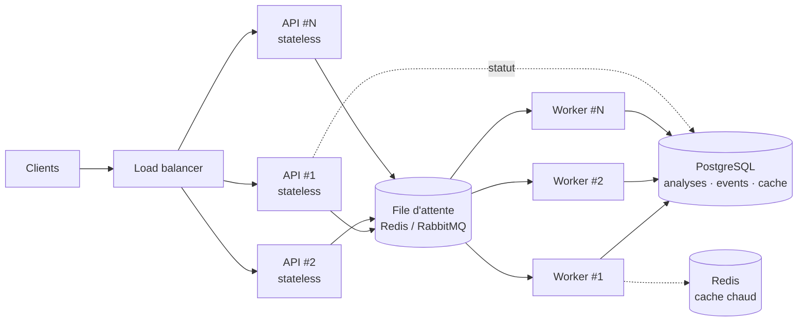

# Réponses aux questions théoriques (étapes 4 à 7)

> Réponses détaillées aux étapes 4 à 7 du test « Développeur IA — Agent d'analyse de marché e-commerce ». Chaque réponse est ancrée dans le code livré (chemins de fichiers à l'appui) plutôt que dans l'abstrait ; le [README](../README.md) en donne les résumés.

## Étape 4 — Architecture de données et stockage

Aujourd'hui, la persistance est un `JobRegistry` en mémoire (`api/registry.py`) : un `dict[str, Job]`, dont toutes les méthodes sont synchrones — donc atomiques sur la boucle d'événements, sans verrou nécessaire. C'est un choix délibéré pour le périmètre de ce test : zéro dépendance externe, trivial à faire tourner et à raisonner, suffisant pour une démo mono-processus. Mais cet état ne survit pas à un redémarrage, ne scale pas au-delà d'un seul processus, et n'offre aucune capacité de requête ou d'audit. Voici l'architecture que je proposerais pour passer en production.

**PostgreSQL comme source de vérité**, avec des colonnes `JSONB` pour les sorties semi-structurées du graphe plutôt qu'un schéma entièrement normalisé — ce sont des objets Pydantic déjà validés, les dénormaliser en dizaines de colonnes n'apporterait rien, alors qu'un simple document store (sans SQL, sans jointures) empêcherait les requêtes analytiques qu'une équipe produit ou ops finira par vouloir (« score moyen du juge par fournisseur sur les 7 derniers jours »). Quatre tables :

- **`analyses`** — `id` (uuid), `query`, `plan` (jsonb), `report` (jsonb), `status`, `provider`, `model`, `cost_usd`, `duration_ms`, `created_at`/`updated_at`. Index GIN sur `report` pour interroger, par exemple, les recommandations par priorité sans dénormaliser.
- **`analysis_events`** — table append-only : `id`, `analysis_id` (fk), `type`, `node`, `payload` (jsonb), `created_at`. Une trace d'audit durable de la progression nœud par nœud : elle permet de reconstruire le déroulé d'une analyse après coup et rend possible un suivi de progression durable (y compris un flux type SSE reconstructible après redémarrage), là où le MVP se limite volontairement à un statut interrogeable en mémoire.
- **`collected_data_cache`** — clé `(query normalisée, platform)`, `payload` (jsonb), `fetched_at`, `expires_at`. Avec des adaptateurs mock déterministes le cache ne change rien à la correction ; avec de vrais scrapers, il évite de solliciter de nouveau une API tierce, souvent rate-limitée, pour une requête identique dans une fenêtre de temps courte.
- **`agent_configs`** — `id`, `name`, `version`, `prompt_template`/`thresholds` (jsonb), `is_active`, `created_at`. Remplace les constantes de prompt codées en dur (`PLANNER_SYSTEM`, `SYNTHESIS_SYSTEM`, `JUDGE_SYSTEM` dans `agent/nodes.py`) par un registre versionné, modifiable sans déploiement — la brique sur laquelle s'appuie l'étape 7 (A/B testing).

**Redis pour deux besoins que Postgres sert mal** : une file de jobs, remplaçant le `asyncio.create_task` in-process actuel de `AnalysisService` par un vrai découplage soumission/exécution — condition nécessaire au scaling horizontal de l'étape 6 —, et un cache chaud (le TTL de `collected_data_cache` est un cas d'usage naturel de clé Redis avec expiration, moins coûteux qu'un scan de ligne Postgres pour une donnée lue bien plus souvent qu'écrite).

**Fichiers/objet (S3 ou équivalent)** pour les rapports rendus. L'embryon local existe déjà : chaque analyse terminée est archivée sur disque (`RUNS_DIR`, défaut `runs/` — ressource JSON complète + rapport Markdown, écriture non-fatale en cas d'échec). À l'échelle, ces artefacts partent vers un stockage objet et sont servis statiquement — on évite de régénérer le rendu à chaque lecture et on prépare un futur lien de partage public.

**Pourquoi pas une seule base « à tout faire »** (Mongo seul, Redis seul) ? `analyses` a besoin de garanties relationnelles réelles (clé étrangère depuis `analysis_events`, transitions de statut transactionnelles) et de requêtes analytiques ad hoc que seul SQL + JSONB offre sans sacrifier la flexibilité du schéma. Redis, à l'inverse, est volontairement cantonné à la file et au cache — rien n'y vit de façon durable, pour qu'un flush Redis ne soit jamais un incident de perte de données.

## Étape 5 — Monitoring et observabilité

**Tracing.** Le logging structuré JSON est déjà en place (`core/logging.py` — chaque ligne de log est un objet JSON `{level, logger, message, time, ...}`, enrichi via `extra={"ctx": {...}}`), et les points clés du pipeline sont déjà tagués : le planner logue le plan produit, chaque nœud à risque logue son erreur en cas de dégradation (`agent/nodes.py`), et le service logue l'échec ou le dépassement de délai d'une analyse avec son `analysis_id` (`api/service.py`). Concrètement, ces logs peuvent être expédiés tels quels vers Loki, Datadog ou ELK — le JSON structuré est déjà le format que ces outils consomment nativement, sans changement de code, seulement de la configuration de collecte. Au-dessus, des spans OpenTelemetry (un span par nœud, rattaché à un span racine par analyse, `analysis_id` en attribut) donneraient des percentiles de latence et la corrélation inter-services pour le jour où il y aura plus d'un service. LangSmith, natif LangGraph, est intéressant en complément — pas en remplacement : il apporte une vue spécifiquement LLM (prompts/réponses, timeline token par token) que l'APM générique n'offre pas. À activer par variable d'environnement, optionnel.

**Métriques clés**, et où elles existent déjà dans le code :
- latence par analyse — `duration_ms` déjà présent dans les métadonnées de réponse ; la latence *par nœud* (p50/p95) demande les spans OpenTelemetry proposés ci-dessus, un par nœud ;
- taux d'échec par outil — `AnalysisError.source`/`.code`, déjà accumulés dans `state["errors"]` ;
- tokens par analyse et par fournisseur — `LLMUsage` (tokens d'entrée/sortie, `purpose`, `model`) est déjà capturé à chaque appel et agrégé dans `AnalysisService._build_meta` ; le coût s'en déduit avec une grille de tarifs par modèle (extension directe) ;
- score du juge, distribution et taux de révision — déjà calculé par analyse (`judge_score`, `revised` dans les métadonnées de réponse) ; il manque seulement l'agrégation dans le temps ;
- débit et taille de file — inexistant tant que le registre est en mémoire mono-processus ; devient mesurable dès que la file Redis de l'étape 6 existe.

**Alerting** : taux d'erreurs `LLM_FAILURE` au-dessus d'un seuil, coût cumulé/jour au-dessus d'un budget, score médian du juge en baisse sur une fenêtre glissante — signal de dérive qualité, la donnée brute existe déjà par analyse, il manque l'agrégation et le seuil —, latence p95 en hausse.

**Qualité des sorties.** Le nœud `judge` est déjà, de facto, une notation automatique par rapport (grounding, complétude, actionnabilité) — l'étape 7 détaille comment l'étendre en évaluation offline. En complément, un échantillonnage humain périodique (relire N rapports/semaine tirés au hasard avec la même grille que le juge) sert à calibrer la dérive entre le score du juge et un jugement humain — sans quoi une dérive du juge lui-même passerait inaperçue.

## Étape 6 — Scaling et optimisation

### Déploiement

Le principal obstacle à ce déploiement, dans le code actuel, est que tout l'état vit dans le processus : `JobRegistry` est un dictionnaire en mémoire et `AnalysisService._tasks` un dict de `asyncio.Task`. Une fois l'état déplacé vers Postgres (étape 4) et l'exécution vers un pool de workers consommant une file Redis/RabbitMQ partagée, la couche API redevient triviale à répliquer : n'importe quelle instance peut accepter une requête, n'importe quel worker peut l'exécuter, et le suivi de statut se lit depuis le store partagé plutôt que depuis la mémoire d'un process précis.

**100+ analyses simultanées.** Il faut des files avec de la contre-pression et des quotas par client — pas seulement la limite implicite de la boucle d'événements d'aujourd'hui —, et retourner `429`/`Retry-After` au-delà du quota plutôt que de dégrader la latence de tout le monde.

**Coûts LLM.**
- *Routage par complexité* : `planner` et `judge` sont des tâches de sortie structurée courtes et peu ambiguës qu'un modèle petit/rapide gère bien ; `synthesize` est le seul appel qui bénéficie vraiment d'un modèle plus fort, puisque c'est le texte que l'utilisateur final lit. Le champ `purpose`, déjà transmis à chaque appel `StructuredLLM.generate`, est justement ce qu'il faut pour router par modèle selon la tâche — une extension ciblée de la factory actuelle, pas une refonte.
- *Prompt caching* côté fournisseur (Anthropic/OpenAI) pour les system prompts largement statiques (`PLANNER_SYSTEM`, `SYNTHESIS_SYSTEM`, `JUDGE_SYSTEM`).
- *Batch API* pour les usages non temps-réel — une ré-analyse nocturne d'une liste de veille n'a aucune raison de payer le tarif synchrone.
- *Budgets par requête* : les tokens sont déjà capturés par appel (`LLMUsage`, agrégés dans `_build_meta`) ; il manque une grille de tarifs et une vérification avant/pendant l'exécution pour plafonner le coût, pas seulement le mesurer.

**Cache intelligent** — non implémenté dans le MVP actuel (aucune ligne de cache dans le code aujourd'hui), mais l'architecture s'y prête sans réécriture, à trois niveaux :
1. données collectées par `(query, platform)`, TTL court — `collect` est un nœud purement I/O, sans effet de bord, donc une clé de cache évidente ;
2. résultat d'analyse complet avec invalidation — une requête identique dans une fenêtre de temps renvoie le `MarketReport` déjà calculé au lieu de rejouer tout le graphe (le déterminisme du provider mock préfigure déjà cette idée : même requête, même résultat) ;
3. cache sémantique par embeddings de requêtes similaires (« iPhone 16 » ≈ « iPhone 16 128 Go ») — le niveau le plus riche et le plus coûteux à bien faire, à traiter en dernier.

**Parallélisation.** Déjà démontrée dans le graphe livré, à deux niveaux : `sentiment` et `trends` s'exécutent en parallèle via le fan-out conditionnel de LangGraph (`route_after_collect` peut retourner les deux branches à la fois), et à l'intérieur même de `collect`, les appels aux adaptateurs de plateforme sont parallélisés avec `asyncio.gather` sur un nombre arbitraire de plateformes — déjà N-way, pas limité à trois. L'extension naturelle est l'API `Send` de LangGraph, utile le jour où un traitement par plateforme nécessite lui-même un nœud (par exemple un résumé LLM par plateforme) : un fan-out dynamique *au niveau du graphe*, plutôt qu'à l'intérieur d'une seule fonction Python comme c'est le cas aujourd'hui dans `collect`.

## Étape 7 — Amélioration continue et A/B testing

**Le LLM-as-judge est déjà en production dans ce dépôt**, pas seulement à l'état de proposition théorique : le nœud `judge` (`agent/nodes.py`) note chaque rapport sur une grille {ancrage dans les données, complétude par rapport au plan, actionnabilité} et déclenche une révision bornée (`graph.py`). L'étendre en évaluation offline est direct puisque c'est déjà une fonction pure de `(plan, rapport, disponibilité des données)`, réutilisable hors du chemin de requête live : geler un golden set de requêtes avec le comportement attendu (quel plan, quels faits doivent apparaître), le rejouer à chaque changement de prompt ou de modèle, et suivre la distribution des scores du juge dans le temps comme signal de non-régression.

**Comparaison de prompts.** Remplacer les constantes de prompt codées en dur dans `agent/nodes.py` par le registre versionné `agent_configs` introduit à l'étape 4 (nom, version, `prompt_template`/seuils, `is_active`). L'A/B se fait par assignation aléatoire — mais déterministe par hash de l'identifiant d'analyse, pour qu'un run rejoué reste reproductible — d'une variante par analyse, avec comme métriques de comparaison le score du juge et, une fois branché, le feedback utilisateur ci-dessous.

**Boucle de feedback.** Un endpoint `POST /api/v1/analyses/{id}/feedback {rating, comment}` — à ajouter, il n'existe pas encore aujourd'hui — stockerait une évaluation humaine liée à l'analyse et à sa trace complète (`analysis_events`, étape 4), constituant progressivement le jeu de données labellisé dont une évaluation offline, ou un futur fine-tuning, a besoin. Le reste de l'API expose déjà tout ce qu'il faut pour joindre ce feedback à un rapport complet (`GET /api/v1/analyses/{id}`).

**Faire évoluer les agents.** La séparation outils/nœuds — les outils sont de simples fonctions, les nœuds de fins wrappers LangGraph, voir la section Outils du README — fait qu'un cinquième type d'analyse (par exemple « disponibilité » ou « comparaison de fiches techniques ») s'ajoute comme une nouvelle branche du graphe : un nouvel outil, un nouveau nœud, une valeur de plus dans `AnalysisKind`, un edge conditionnel de plus, sans toucher au planner, à `collect`, à `synthesize` ou au juge existants. Le déploiement progressif (canary) de nouveaux prompts ou modèles devient possible dès que `agent_configs` existe : router un petit pourcentage du trafic vers la nouvelle variante, observer le score du juge, monter en charge ou revenir en arrière.

