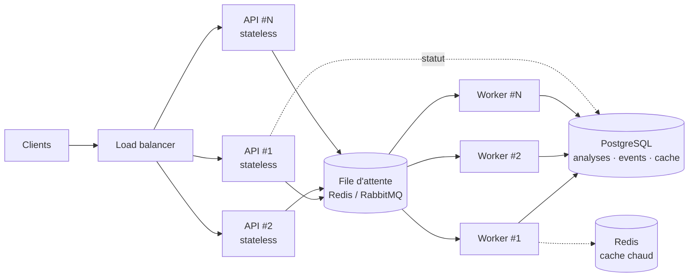

# Réponses aux questions théoriques (étapes 4 à 7)

> Réponses aux étapes 4 à 7 du test, dans l'ordre exact des questions posées. Chaque réponse s'appuie sur le code livré (chemins de fichiers à l'appui) ; le [README](../README.md) documente le système lui-même.

## Étape 4 — Architecture de données et stockage

**Stocker les résultats d'analyse.** Table Postgres `analyses` : `id` (uuid), `product`, `plan` (jsonb), `report` (jsonb), `status`, `provider`, `model`, `duration_ms`, `created_at`. Les sorties du graphe sont des objets Pydantic déjà validés : `JSONB` les stocke tels quels tout en restant requêtables (index GIN — ex. filtrer les recommandations par priorité), sans dénormalisation.

**Maintenir l'historique des requêtes.** Table append-only `analysis_events` : `id`, `analysis_id` (fk), `type`, `node`, `payload` (jsonb), `created_at`. Une ligne par étape franchie : à la fois trace d'audit et source de rejeu du déroulé d'une analyse après redémarrage. Dans le MVP livré, ce rôle est tenu par le registre en mémoire plus l'archive fichier `runs/`.

**Cacher les données collectées.** Clé Redis `(produit normalisé, plateforme)` avec TTL court ; table miroir `collected_data_cache` (`payload` jsonb, `fetched_at`, `expires_at`) si la persistance du cache est utile. Avec de vrais scrapers, ce cache évite de re-solliciter des APIs tierces rate-limitées pour une même requête rapprochée — `collect` est un nœud purement I/O sans effet de bord, donc une clé de cache évidente.

**Gérer les configurations d'agents.** Table `agent_configs` : `name`, `version`, `prompt_template`/`thresholds` (jsonb), `is_active`. Elle remplace les constantes de prompt de `agent/nodes.py` (`PLANNER_SYSTEM`, `SYNTHESIS_SYSTEM`, `JUDGE_SYSTEM`) par un registre versionné, modifiable sans déploiement — la base de l'A/B testing de l'étape 7.

**Quel système de stockage, et pourquoi ? PostgreSQL (source de vérité) + Redis (file et cache) + stockage objet (rapports rendus).** Postgres parce que `analyses` et `analysis_events` exigent des garanties relationnelles (clés étrangères, transitions de statut transactionnelles) et des requêtes analytiques ad hoc — « taux de passage du juge par fournisseur sur 7 jours » — que seul SQL + JSONB offre sans figer le schéma. Redis est volontairement cantonné à l'éphémère : rien d'irremplaçable n'y vit, donc un flush Redis n'est jamais un incident de perte de données. Stockage objet (S3) pour les artefacts rendus : le dossier `runs/` livré (JSON + Markdown par analyse terminée) en est l'embryon local déjà implémenté. Le registre en mémoire actuel est un choix de périmètre assumé — son interface `create/get/list_jobs` est exactement celle que la version Postgres implémenterait.

## Étape 5 — Monitoring et observabilité

**Tracer l'exécution des agents.** Trois couches. ① Le logging JSON structuré est déjà en place (`core/logging.py`) : chaque ligne est un objet `{level, message, time, ctx}` — le planner logue le plan produit, chaque nœud à risque logue sa dégradation, le service logue échecs et timeouts avec `analysis_id` (`api/service.py`) — expédiable tel quel vers Loki, Datadog ou ELK, sans changement de code. ② Au-dessus : spans OpenTelemetry, un par nœud rattaché à un span racine par analyse (`analysis_id` en attribut), pour les percentiles de latence par nœud et la corrélation inter-services. ③ LangSmith (natif LangGraph) en complément optionnel pour la vue spécifiquement LLM (prompts/réponses), activable par variable d'environnement.

**Collecter les métriques de performance.** Les données existent déjà par analyse dans `_build_meta` (`api/service.py`) : `duration_ms`, tokens entrée/sortie par appel (`LLMUsage`, taggé `purpose` et `model`), `llm_calls`, verdicts du juge par critère, `revised`, `degraded`. Il ne manque que l'agrégation dans le temps : export Prometheus, ou dérivation directe depuis les logs JSON.

**Alerter en cas de dysfonctionnement.** Seuils sur quatre signaux : taux d'erreurs `LLM_FAILURE` par fournisseur, latence p95 en hausse, coût cumulé/jour au-dessus du budget, et taux d'échec d'un critère du juge en hausse sur fenêtre glissante — ce dernier est l'alerte de dérive *qualité*, pas seulement de disponibilité.

**Mesurer la qualité des outputs.** Le nœud `judge` le fait déjà en production : trois critères pass/fail par rapport (ancrage vérifié contre les données sources fournies au juge, complétude par rapport au plan, actionnabilité), conjonction appliquée en code. En complément : échantillonnage humain périodique — relire N rapports/semaine avec la même grille — pour calibrer la dérive entre le juge et un jugement humain, sans quoi une dérive du juge lui-même passerait inaperçue.

**Métriques clés surveillées.** Latence par analyse (p50/p95) puis par nœud ; taux d'échec par outil (`AnalysisError.source`) ; tokens et coût par analyse et par fournisseur ; taux de passage par critère du juge ; taux de révision ; taux d'analyses dégradées ; débit et taille de file dès que la file de l'étape 6 existe.

## Étape 6 — Scaling et optimisation

**Gérer des pics de charge (100+ analyses simultanées).** Découpler soumission et exécution : API stateless répliquée derrière un load balancer, file Redis/RabbitMQ, pool de workers consommateurs. Le seul obstacle dans le code actuel est l'état in-process (`JobRegistry` en mémoire, `AnalysisService._tasks`) — une fois l'état déplacé vers Postgres (étape 4) et l'exécution vers la file, l'API se réplique trivialement : n'importe quelle instance accepte, n'importe quel worker exécute. Au-delà de la capacité : contre-pression et quotas par client, réponse `429`/`Retry-After` plutôt que dégrader la latence de tout le monde.

**Optimiser les coûts d'utilisation des LLM.** Quatre leviers. ① Routage de modèle par tâche : `planner` et `judge` sont des sorties structurées courtes qu'un petit modèle gère bien ; seul `synthesize` mérite un grand modèle — le champ `purpose`, déjà transmis à chaque `StructuredLLM.generate`, est le point de routage (simple extension de la factory). Constaté sur ce projet : la même analyse passe de moins d'un cent (`gpt-4o-mini`) à ~20 cents (`gpt-5`). ② Prompt caching côté fournisseur sur les system prompts, largement statiques. ③ Batch API pour le non-temps-réel (ré-analyse nocturne d'une liste de veille). ④ Plafond par requête : les tokens sont déjà mesurés par appel (`LLMUsage`) ; il manque une grille de prix par modèle et une coupure en cours d'exécution pour plafonner, pas seulement mesurer.

**Implémenter un système de cache intelligent.** Trois niveaux, du plus simple au plus riche : ① données collectées par `(produit, plateforme)` avec TTL — `collect` est pur I/O, clé de cache évidente ; ② résultat d'analyse complet — une requête identique dans la fenêtre renvoie le `MarketReport` déjà calculé sans rejouer le graphe ; ③ cache sémantique par embeddings de requêtes voisines (« iPhone 16 » ≈ « iPhone 16 128 Go ») — le plus délicat à régler, à traiter en dernier. Aucun niveau n'est implémenté dans le MVP (choix de périmètre) ; l'architecture s'y prête sans réécriture.

**Paralléliser les tâches d'analyse.** Déjà fait à deux niveaux dans le code livré : `sentiment` et `trends` s'exécutent en parallèle via le fan-out conditionnel du graphe (`route_after_collect` peut activer les deux branches simultanément, fan-in sans conflit par reducers), et `collect` interroge les N plateformes en parallèle (`asyncio.gather` + `to_thread`). Extension naturelle : l'API `Send` de LangGraph pour un fan-out dynamique au niveau du graphe, le jour où chaque plateforme mérite son propre nœud (ex. un résumé LLM par plateforme).

## Étape 7 — Amélioration continue et A/B testing

**Évaluer automatiquement la qualité des analyses (LLM as Judge).** Implémenté : le nœud `judge` (`agent/nodes.py`) évalue chaque rapport sur trois critères pass/fail — ancrage vérifié contre les données sources (le juge reçoit les mêmes données que la synthèse), complétude par rapport au plan, actionnabilité — avec conjonction appliquée en code et révision bornée (`graph.py`). Extension offline : geler un golden set de produits, le rejouer à chaque changement de prompt ou de modèle, suivre le taux de passage par critère comme signal de non-régression — direct, puisque le juge est une fonction pure de `(plan, données, rapport)`.

**Comparer différentes stratégies de prompt engineering.** Versionner les prompts dans `agent_configs` (étape 4) au lieu des constantes actuelles de `agent/nodes.py`. A/B par assignation aléatoire d'une variante par analyse — déterministe par hash de l'`analysis_id`, pour qu'un rejeu reste reproductible. Métriques de comparaison : taux de passage des critères du juge, et le feedback utilisateur ci-dessous une fois branché.

**Implémenter un feedback loop utilisateur.** Un endpoint `POST /api/v1/analyses/{id}/feedback {rating, comment}` — à ajouter, il n'existe pas aujourd'hui — stocké et joint à la trace complète de l'analyse (`analysis_events`). Double usage : métrique produit immédiate, et constitution progressive du jeu de données labellisé dont l'évaluation offline — ou un futur fine-tuning — a besoin. `GET /api/v1/analyses/{id}` expose déjà tout le contexte à joindre au feedback.

**Faire évoluer les capacités des agents.** L'architecture le permet sans toucher l'existant : un nouveau type d'analyse (ex. « disponibilité », « comparaison de fiches techniques ») = un nouvel outil + un nouveau nœud + une valeur dans `AnalysisKind` + un edge conditionnel — planner, `collect`, `synthesize` et `judge` inchangés (séparation outils/nœuds, voir la section Outils du README). Déploiement progressif via `agent_configs` : canary sur un petit pourcentage du trafic, observer les verdicts du juge, promouvoir ou revenir en arrière.
